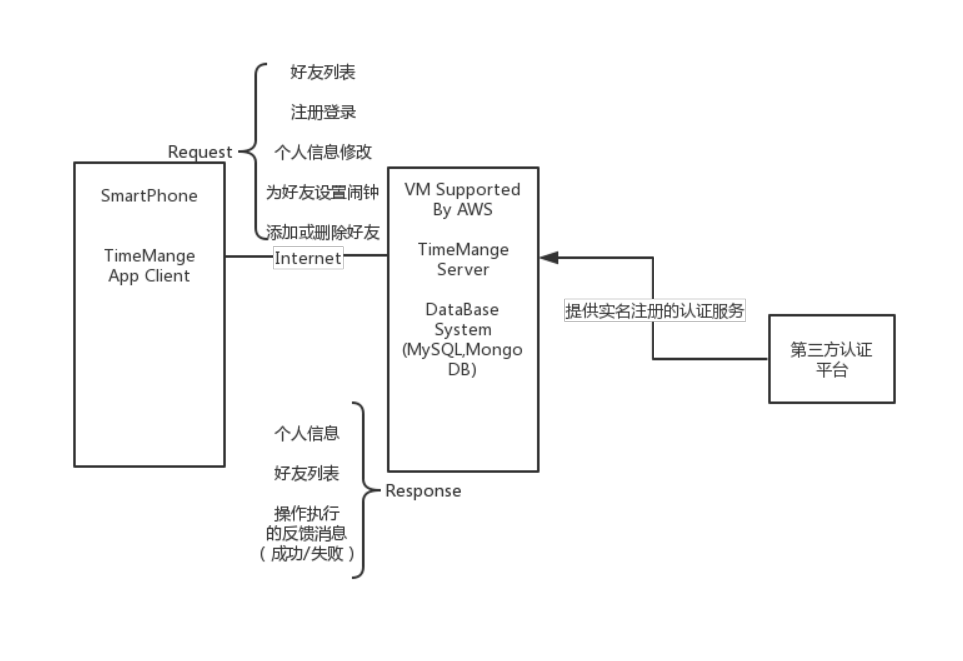

Vision文档
==============================

1\. 简介
---------------------
- 1.1 目的  
  本文档用于收集、分析和定义一心（时间管理APP）的高层次需求和特性，侧重于涉众和目标用户所需的功能以及这些需要存在的原因以达到分析项目前景、机遇、风险的目的。  
- 1.2 范围  
  本文档面向一心（时间管理APP）的开发人员、测试人员、管理人员以及最终用户而编写。  
- 1.3 定义、首字母缩写词和缩略语  
    - **闹钟**：能够在预定时间发出铃声提醒用户的APP，在本项目中需要完成一些小任务才能关闭铃声。
    - **任务**：本文中指用来关闭闹钟铃声的小任务，包括小游戏、摇晃手机、唱歌、数学题等。
    - **学习模式**：所有手机通知将被屏蔽，除部分应用外的应用将被锁定的APP模式，但仍可接听电话，拍照和使用紧急呼叫。
    - **学习青蛙**：类似于Forest的种树，学习模式的卡通化，当用户使用学习模式时学习青蛙会开始学习。
    - **激励机制**：完成任务或学习后的奖励，量化为学习青蛙的学习成果，可以给用户带来成就感和激励感。
    - **等级**：按某一标准区分的高下差别，在本项目中，根据学习时间的长短学习青蛙划分为不同学历。
    - **用户信息**：指用户名称、用户性别、用户联系方式等一些关于用户的基本资料。
    - **好友**：用户可以与其他用户建立好友社交关系，好友通过该项目APP可以互设任务闹钟。
- 1.4 参考资料  
  [1] 沈备军，陈昊鹏，陈雨亭 《软件工程原理》 高等教育出版社
- 1.5 概述  
  本文档将分析当前所存在的问题，分析业务需求并提出多种解决方案，识别项目干系人、项目的约束来明确产品的定位，最后撰写产品的特性并划分特性优先级、定义质量范围、定义文档需求。

2\. 定位
---------------------------------
- 2.1	商机
  随着移动互联网时代的发展，手机发展迅速、功能也越来越强大，但是这也导致了人们越来越依赖手机，甚至出现了手机成瘾症，只要手机不在身边一刻就会坐立不安，而不用手机一整天会觉得与世隔绝，特别没有安全。有研究发现，人们每天在智能手机上轻触、滑动、按键的次数多达2617次，在我们的调查问卷中有超过80%的人同意手机占用了太多的时间。另一方面，起床困难也成为当代很多年轻人的标签。在我们的调查中有许多人存在关掉闹钟后马上又睡着的现象。因此，本项目旨在开发一款关键管理APP让用户摆脱“低头族”和“起床困难户”的标签。
- 2.2	问题说明  
  |问题是|年轻人起床困难、有手机依赖症|
  |-----|-----|
  |**影响**|**学生群体、不依赖手机工作的职场人士**|
  |**问题的后果**|**学习工作的效率和质量降低，影响正常生活**|
  |**成功的解决方案**|**利用趣味闹钟使用户在关闭闹钟的时候逐渐清醒过来，不再赖床；利用深度学习模式帮助用户在工作学习等期间，暂时放下手中的手机，专注于真正需要做的事情从而提高学习工作的效率，进而改善用户的生活习惯、远离手机成瘾症。**|
- 2.3	产品定位说明  
  |针对于|当代年轻人，主要为大学生群体|
  |-----|-----|
  |**谁**|**存在起床困难、手机依赖症**|
  |**该产品**|**属于移动手机APP**|
  |**功能**|**1.页面干净整洁，用户可以自主选择主题风格; 2.趣味闹钟有多款任务让用户清醒; 3.通过完成闹钟任务或者深度学习任务，用户可以获得积分使自己领养的学习青蛙升级（获得更高的学历），以此作为软件的激励机制.**
  |**不同于**|**Forest、番茄ToDo**|
  |**我们的产品**|**1. 使用简单易上手，对新用户很友好，不用花大量时间编辑各种安排表，设定时间就可以随时开始; 2.功能更加全面，添加了趣味闹钟等相关功能; 3.模式更加多样，在学习模式下有深度模式和常规模式两种; 4.免费使用，对大学生群体更加友好**|

3\. 涉众和用户说明
------------------------
- 3.1	市场统计  
  大学生群体中有很大部分人存在起床困难、手机依赖症等问题，需要一个时间管理APP来合理分配学习时间、提高学习的效率和质量。  
  用户受过教育，并且在大多数情况下，拥有个人手机。  
  一心的最初发行版将限于课程内，在之后考虑继续完善该APP。
- 3.2	涉众概要  
  |名称|说明|角色|
  |-----|-----|-----|
  |维护人员|项目小组成员|管理数据库、添加新功能|
  |用户|主要为大学生群体|确保软件满足用户的需求|
- 3.3	用户概要
  |名称|说明|涉众|
  |-----|-----|-----|
  |用户|趣味闹钟和学习模式|自我代表|
  |管理员|管理用户的数据库，添加新增界面等|自我代表|
- 3.4	用户环境  
  大学生群体中有很大部分人存在起床困难、手机依赖症等问题，需要一个时间管理APP来合理分配学习时间、提高学习的效率和质量。  
  用户受过教育，并且在大多数情况下，拥有个人手机。  
  一心的最初发行版将限于课程内，在之后考虑继续完善该APP。
- 3.5	关键的涉众/用户需要  
  |需要|优先级|关注的要点|目前的解决方案|提议的解决方案|
  |-----|-----|-----|-----|-----|
  |用户起床困难|高|清醒的小任务|目前大部分年轻人通过手机自带的闹钟或者让他人叫醒的方式来克服起床困难。|到用户设定的时间时，闹钟响起，任务开启，用户需要完成指定任务（如吹气、解数学题、摇动手机等）才能够关闭闹钟继续使用手机。闹钟的铃声支持周期循环。|
  |用户有手机依赖症，需要拜托手机、专心于学习或工作|高|摆脱手机|用户使用Forest等产品或不带手机去学习。|深度学习模式：用户点击开始该功能后，软件将记录用户连续不使用手机的时间，期间用户完全禁止使用手机，否则计时停止。番茄学习模式：用户点击开始该功能后，在用户设定的时间内，连续学习50分钟，会给予用户10分钟休息时间，在这段时间内，用户可以自由使用手机，达到劳逸结合的目的。|
  |社交功能|中|好友等功能增加用户粘性、丰富用户的体验|Forest中有好友排行、好友共同种树等功能|用户可以添加好友；可以邀请好友为自己设置闹钟或者给好友设置闹钟。用户还可以分享自己的任务完成情况和学习情况到社交媒体。|
- 3.6	备选方案和竞争  
  -  3.6.1	Forest  
     - **优点：**  
       1. 使用简单易上手，对新用户很友好，不用花大量时间编辑各种安排表，设定时间就可以随时开始。  
       2. 页面干净整洁，没有广告，设计感好评。  
       3. 专注时间可以兑换金币，金币可以解锁新的植物，也可以兑换现实中真实的树木，有公益和环保方面的贡献。这种金币激励制度很能激起使用的欲望。  
       4. 价格便宜：该软件在安卓平台上是免费的、在IOS平台上是收费的（12元）。  
       5. 有好友功能，存在好友间的竞争性和丰富的社交性（如分享等）使用户粘性加强。  
   
     - **缺点：**  
       1. 部分手机，即便在勿扰模式，新消息抵达仍然会弹出。导致用户很难真的忽视这条消息而继续专注。  
       2. 在好友排行中过分攀比导致恶性使用问题。  
       3. 多人种树模式下，种树须同时开始，同时结束，导致部分成员不得不做出妥协。
  - 3.6.2	怪物闹钟  
    - **优点：**
      1. 打破传统闹钟的理性和严肃，主打有趣风格，用可爱的卡通形象和有趣的动物声音吸引用户。
      2. 除了闹钟的主要功能外，“怪物闹钟”还辅助了天气、新闻、人气话题等实时信息，为人们提供便利。
      3. 可以让用户定制自己喜欢的颜色，定制自己喜欢的明星和偶像叫早。  
    - **缺点：**  
      1. “怪物闹钟”的声音震耳欲聋，无法调低音量，在大学宿舍中使用不方便。  
      2. 需要获取用户的很多权限。  
      3. 功能过于冗杂，界面不够整洁，用户体验不好。  

4\. 产品概述
---------------------------
本小节主要介绍该时间管理APP的功能，与其他平台和产品的相关接口以及系统配置。  
- 4.1	产品总体效果  
  与竞争产品Forest不同，本APP由于提供了社交功能，需要用户在注册时提供自己的手机号码和姓名，因此将利用阿里云、聚合数据以及百数等第三方渠道提供的接口进行实名认证。  
  本App将由服务器端和客户端两部分组成。服务器端限于成本将依赖于Amazon Web Service提供的一系列云计算服务。同时，它将通过JDBC来获取由MySQL及MongoDB支持的数据库服务。  
  客户端将依赖于一台智能手机。智能手机可通过应用商店，二维码以及网址的下载链接来获取我们的客户端应用。在安装后，用户在未登录情况下可以使用基本的闹钟设置以及远离手机等功能，基于设计的好友功能则需要用户通过手机号及验证码进行登录解锁。  
    
- 4.2	功能摘要
  |客户利益|支持特性|
  |-----|-----|
  |防止用户过于简单地关闭闹钟，帮用户集中注意力，迅速清醒，从而摆脱起床拖延症。|通过完成指定的任务来关闭闹钟。|
  |让用户拥有更多自主选择的空间和更个性化的使用体验。|用户可以自定义添加任务，如自行设计相关的算术题等。|
  |增加激励机制，让用户在改善自己时间使用习惯的同时获得成就感。|用户完成任务可以获得一定的积分|
  |增加社交功能，可以与好友组队互相监督，共同进步，改善时间习惯。|拥有好友系统，可以接受好友请求为好友设置闹钟。|
  |通过报表，用户可以得到及时的反馈来进行计划的完善，通过分享，用户可以获得成就感。|用户可以生成自己时间管理情况的报表，并且进行分享。|
- 4.3	假设与依赖关系  
  DE-1: 要求客户端运行的平台为Android  
  DE-2: 需要存储的用户个人信息的数据结构被MongoDB和MySQL等所支持  
  DE-3: 服务器需要AWS提供相应的云计算服务  
  AS-1: 阿里云、聚合数据和百数总能找到合适的第三方信息认证接口提供商  
- 4.4	成本与定价  
  成本主要来自于第三方信息认证服务的收费以及在AWS上服务器部署运营的开销。认证服务考虑到用户量，最多不会超过$100。由于AWS账户拥有一定免费额度，考虑到我们运行的时间，这部分的成本最多不会超过$350.
- 4.5	许可与安装   
  运行时要求获得手机的存储、照相机、麦克风、访问手机/电话、后台运行以及锁屏等权限。  
  手机将通过应用商店，网址链接或者二维码获取相应的安装包进行安装。

5\. 产品特性
---------------------------
- 5.1	账户注册  
  用户可以用手机号码注册账号。手机号码注册的方式更加方便。
- 5.2	手机号码检查与验证  
  系统会对手机号码的唯一性以正确性进行检验，并向该手机发送验证码，帮助用户完成注册。
- 5.3	个人信息完善  
    用户注册完成后，可以完善自己的个人信息，包括用户名、密码、姓名、性别、电子邮箱。
- 5.4	密码安全性检查  
    用户设置密码后，系统会检查密码的安全性，包括是否过于简单或者过于常见。
- 5.5	邮箱检查与验证  
  用户可以绑定邮箱，系统会检查邮箱的正确性和唯一性，并向用户注册邮箱发送激活邮件，邮件中包含激活地址，点击该地址可完成激活。
- 5.6	用户登录  
    已注册的用户可以用手机验证码或者密码登录账号，体验软件的完整功能。
- 5.7	个人信息维护  
    用户可以修改自己的个人信息，包括用户名、密码、姓名、性别、邮件地址。
- 5.8	修改软件主题风格  
    用户可以修改软件主题风格，包括更改主题色、黑夜模式等。可以给用户更加个性化的体验。
- 5.9	奖励机制  
    用户在软件中将获得一只青蛙，通过完成闹钟任务以及使用远离手机功能可以获得积分，积分可以用于青蛙养成。青蛙会随着等级的升高而获得更高的学历，以此作为软件的激励机制，使用户在改善自己时间管理的同时也能更有成就感。
- 5.10	闹钟设定  
    用户可以在应用内指定闹钟的时间、任务、周期、奖励积分、铃声等。任务闹钟的设计可以更好地解决用户起床困难等问题。
- 5.11	自然语音设定闹钟  
    用户可以使用语音方式设定闹钟，包括新建闹钟、删除闹钟以及更改设置。
- 5.12	闹钟响起  
    到用户设定的时间时，闹钟响起，任务开启，用户需要完成指定任务才能够关闭闹钟继续使用手机。闹钟的铃声支持周期循环。
- 5.13	任务设定  
  用户必须完成任务才能关闭闹钟，任务包括但不限于完成随机算术题、完成随机小游戏、演唱随机歌曲、按频率摇动手机、对着手机吹气。
- 5.14	任务积分  
  用户完成闹钟任务后，系统将给予用户相应积分，作为激励机制。
- 5.15	任务分享  
    用户完成任务后，可以将任务完成结果分享到第三方社交软件(如微信、QQ等)，或者生成分享截图，这一特性在增加用户成就感的同时，也能宣传推广本产品。
- 5.16	个性化任务推荐  
    系统会为用户推荐合适的闹钟任务，为用户提供更加个性化的使用体验。
- 5.17	远离手机——深度模式  
    用户点击开始该功能后，软件将记录用户连续不使用手机的时间，期间用户完全禁止使用手机，否则计时停止。
- 5.18	远离手机——番茄学习法  
    用户点击开始该功能后，在用户设定的时间内，连续学习50分钟，会给予用户10分钟休息时间，在这段时间内，用户可以自由使用手机，达到劳逸结合的目的。
- 5.19	远离手机——普通模式  
  用户点击开始该功能后，软件将记录用户连续不使用手机的时间，期间用户仅可以使用指定的手机应用，否则计时停止。
- 5.20	远离手机积分机制  
  根据用户的远离手机时间的时长，系统会给予用户对应的积分，作为一项激励机制。
- 5.21	远离手机分享  
  用户可以分享自己的远离手机的时长记录到第三方软件，或者生成分享截图。
- 5.22	好友管理  
  用户可以添加和删除好友，其中添加好友需要经过对方的同意。
- 5.23	好友互动  
  用户可以为好友设定闹钟，也可以邀请好友为自己设定闹钟。
- 5.24	报表分析  
  系统可以为用户生成近期一段时间内时间管理情况的报表，以图表形式展现。
- 5.25	报表分享  
  用户可以将报表分享到第三方软件，或者自动生成分享截图。

6\. 约束
---------------------
+ 系统不需要进行任何硬件的开发。  
+ 系统运行于Android平台之上。  
+ 系统中需要储存的数据类型必须被MySQL、MongoDB支持。  
+ 系统后端使用基于Spring Cloud的微服务架构。  
+ 系统的用户界面要具备较高的易用性和适配性。  
+ 用户需要使用手机号注册账号使用系统。  
  
7\. 质量范围
---------------------------------
+ 性能：系统应支持1000个并发用户，服务器的响应时间不应当超过3秒。  
+ 可靠性：系统必须保证正常情况下每天24小时不间断运行，一年系统平均正常运行时间达到99%。系统应当正确处理发生的异常或者错误，并返回错误信息。  
+ 易用性：系统应易于使用。有使用智能手机经验的用户应当不需要特别的培训就能使用系统的主要功能；同时系统应当提供简单且全面的帮助手册，以方便遇到问题的用户能够在3-5分钟内解决问题。  
+ 可维护性：系统的设计应易于维护。通过例如合理地设计系统、使用面向对象的方法、组件化松耦合、规范接口、维持良好的代码风格、编写全面的设计文档等方法，降低系统维护的成本，提高系统的可维护性。  

8\.	优先级
-----------------------------------
本节介绍了系统功能的优先级。该Vision文档中定义的功能特性应在系统的最终发布版本中全部实现。所有关于闹钟设定和时间管理的基础功能应在技术原型迭代的结果中呈现。  
技术原型成果必须至少包含以下基本功能（按照优先级先后顺序排列）：  
+ 个性化任务闹钟的设置与使用  
+ 时间管理  
+ 用户的注册、认证、登录和注销  
+ 用户个人信息管理  

最终的版本应该包括：  
+ 用户添加好友以及与好友互动的相关功能  
+ 更改界面主题   
+ 用户分享任务完成情况、学习时间  
+ 生成用户使用情况的统计报表

9\.	其他产品需求
---------------------
- 9.1	适用的标准  
    用户接口应该满足Android 9.0及以上。  
- 9.2	系统需求  
    服务器组件运行在AWS的EC2实例之上，且应当运行在Linux操作系统之上。  
    客户端组件运行在Android 9.0及以上的系统的手机上，且硬件配置达到目前主流水平。  
    客户端组件所需的运行内存不超过100MB，所需的储存空间不超过100MB。  
- 9.3	性能需求  
    系统支持最多1000个并发用户，且服务器的响应时间不超过3秒。  
- 9.4	环境需求  
    无  

10\.	文档需求
------------------------
此节介绍了本应用的文档要求  
- 10.1	用户手册  
    用户手册应从用户的角度描述应用的使用，用户手册应包括：
    + 最低系统要求
    + 手机权限要求
    + 注册、登录和注销
    + 所有系统功能
    + 客户支持信息 
 
    用户手册为一般的文档格式，不宜过长，应当简单易懂。用户可以在应用内查看手册。  
- 10.2	联机帮助  
    暂无
- 10.3	安装指南、配置文件、自述文件  
    自述文件应在安装之后显示。自述文件也将保留在手机储存中，并且可供用户随时查看。自述文件应包括：
  + 新发行功能
  + 已知的错误和解决办法
- 10.4	标签与包装  
暂无

