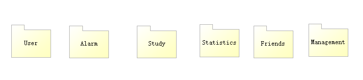
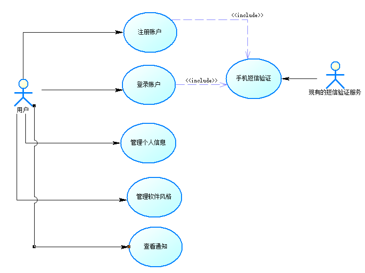
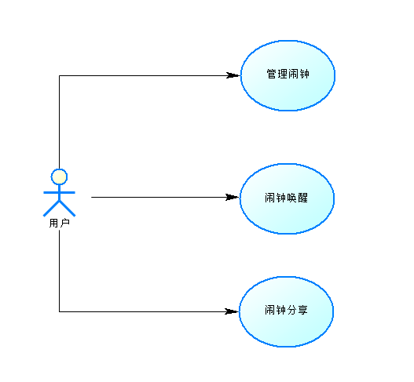
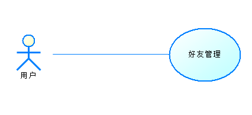
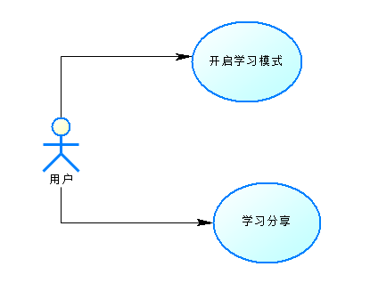
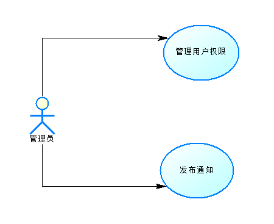
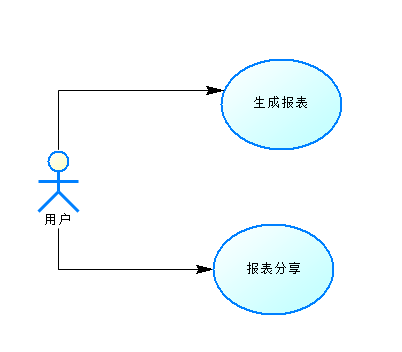

软件需求规约-v1.1
=============================

一、简介
-----------------------
### 1.1 目的
本文档目的在于提供时间管理APP的功能性需求、非功能性需求、设计约束及系统性能参数的说明。
### 1.2 1.2	定义、首字母缩写词和缩略语
**闹钟**：能够在预定时间发出铃声提醒用户的APP，在本项目中需要完成一些小任务才能关闭铃声。  
**任务**：本文中指用来关闭闹钟铃声的小任务，包括小游戏、摇晃手机、唱歌、数学题等。  
**学习模式**：所有手机通知将被屏蔽，除部分应用外的应用将被锁定的APP模式，但仍可接听电话，拍照和使用紧急呼叫。  
**学习青蛙**：类似于Forest的种树，学习模式的卡通化，当用户使用学习模式时学习青蛙会开始学习。  
**激励机制**：完成任务或学习后的奖励，量化为学习青蛙的学习成果，可以给用户带来成就感和激励感。  
**等级**：按某一标准区分的高下差别，在本项目中，根据学习时间的长短学习青蛙划分为不同学历。  
**用户信息**：指用户名称、用户性别、用户联系方式等一些关于用户的基本资料。  
**好友**：通过该项目APP可以互设任务闹钟。  
### 1.3 参考资料
\[1\]沈备军&陈昊鹏&陈雨亭 《软件工程原理》 高等教育出版社

二、整体说明
------------------------
### 产品总体效果
提供一款时间管理app，用户可以设置趣味闹钟、在完成规定的小任务之后才能解锁闹钟来督促自己早起、使用学习模式限制自己在工作时使用手机。通过长时间的app使用，让用户摆脱“低头族”和“起床困难户”的标签。
### 产品功能
**用户注册登录**：用户可以用手机号码注册账号，在注册完成后可以完善自己的个人信息；已注册的用户可以用手机验证码或者密码登录账号，体验软件的完整功能。  
**个人信息维护**：用户可以修改自己的个人信息，包括用户名、密码、姓名、性别、邮件地址。  
**主题选择**：用户可以修改软件主题风格，包括更改主题色、黑夜模式等。可以给用户更加个性化的体验。  
**设置趣味闹钟**：用户可以在应用内指定闹钟的时间、任务、周期、奖励积分、铃声等，到用户设定的时间时，闹钟响起，用户需要完成指定任务才能够关闭闹钟继续使用手机。  
**远离手机**：该板块分为三个模式，分别是普通模式（用户可使用部分手机功能）、深度模式（用户禁止使用手机）和番茄学习法（学习一定时长后可自由使用手机）。  
**积分激励**：用户在软件中将获得一只青蛙，通过完成闹钟任务以及使用远离手机功能可以获得积分，积分可以用于青蛙养成（青蛙会随着等级的升高而获得更高的学历）。  
**社交服务**：用户可以添加和删除好友、为好友添加闹钟、分享自己的学习时长。  
**报表分析**：系统可以为用户生成近期一段时间内时间管理情况的报表，以图表形式展现。  
### 用户特征
本APP面向有起床困难和手机依赖的年轻人，其中主要是大学生群体。他们受过教育，并且在大多数情况下，拥有个人手机，并且需要一个时间管理APP来合理分配学习时间、提高学习的效率和质量。  
### 约束
1. 系统不需要进行任何硬件的开发。
2. 系统运行于Android平台之上。
3. 系统中需要储存的数据类型必须被MySQL、MongoDB支持。
4. 系统后端使用基于Spring Cloud的微服务架构。
5. 系统的用户界面要具备较高的易用性和适配性。
6. 用户需要使用手机号注册账号使用系统。
### 假设与依赖关系
**DE-1**:要求客户端运行的平台为Android
**DE-2**:需要存储的用户个人信息的数据结构被MongoDB和MySQL等所支持
**DE-3**:服务器需要AWS提供相应的云计算服务
**AS-1**:阿里云、聚合数据和百数总能找到合适的第三方信息认证接口提供商
### 需求子集

三、具体需求
----------------------------
### 3.1 功能
#### 3.1.1 Use-case 总图

#### 3.1.2 Use-case图 User功能 
 
#### 3.1.3 Use-case图 Alarm功能

#### 3.1.4 Use-case图 Friends功能

#### 3.1.5 Use-case图 Study功能

#### 3.1.6 Use-case图 Management功能

#### 3.1.7 Use-case图 Statistics功能

#### 3.1.8 注册用户
**描述**：用户注册账户，用于获取使用该产品的权限。  
**执行者**：用户  
**后置条件**：系统记录新创建用户的信息。  
**基本流**：
1. 用户点击初始界面的“注册”按钮  
2. 用户填写手机号码，并点击获取验证码  
3. 现有的短信认证服务调用“手机短信验证”用例   
4. 用户填写用户名、密码、姓名、性别、电子邮箱等 信息  
5. 系统检查用户密码的安全性以及电子邮件格式  
6. 系统向用户输入电子邮件地址发送确认邮件  
7. 用户打开确认邮件激活账户  

**备选流**：
- 2a. 用户输入手机号格式不正确   
  提示用户手机号码格式错误，请重新输入。  
- 5a. 用户输入的密码安全性过低  
  提示用户更改密码使密码有更高的安全性  
- 5b. 用户输入电子邮件地址格式不正确  
  提示用户邮箱格式不正确
#### 3.1.9 登录账户
**描述**: 用户登录账户以使用该app的功能  
**执行者**: 用户  
**前置条件**: 用户已经注册了账号  
**基本流**: 
1. 用户进入主界面,输入手机号和密码,点击“登录”按钮
2. 系统获取手机号,检验到账户存在
3. 系统将密码与数据库中的信息匹配成功
4. 用户登录成功

**备选流**:
- 1a. 用户点击“手机验证码登录”,并输入手机号  
  现有的短信认证服务调用“手机短信验证”用例
- 2a. 系统检测到账户不存在  
  提示用户账户不存在,请先注册账户,用例结束
- 3a. 系统检测到密码与数据库中存储信息不一致   
  提示用户密码错误,请重新输入密码
#### 3.1.10 管理个人信息
**描述**: 用户管理自己账户的个人信息  
**执行者**: 用户  
**前置条件**: 用户已经登录自己的账户  
**基本流**: 
1. 用户点击底边栏“我的”按钮
2. 用户点击“个人信息设置” 
3. 用户修改自己的个人信息并点击确认
4. 系统更改数据库内的用户信息
#### 3.1.11 管理软件风格
**描述**: 用户更改软件的界面风格  
**执行者**: 用户  
**前置条件**: 用户已经登录自己的账户  
**基本流**: 
1. 用户点击底边栏“我的”按钮
2. 用户点击“主题设置”
3. 用户选择想要的主题
4. 系统更改软件风格
#### 3.1.12 查看通知
**描述**：用户查看管理员发布的系统最新通知  
**执行者**：用户  
**前置条件**：管理员已经发布了新通知  
**基本流**：
1. 用户点击底边栏“我的”按钮  
2. 用户点击“关于一心” 
3. 用户查看通知
#### 3.1.13	手机短信验证
**描述**: 第三方认证服务利用用户手机号码提供认证服务  
**执行者**: 现有的短信验证服务  
**前置条件**: 系统发送了认证请求
**基本流**: 
1. 检验号码正确性
2. 生成随机验证码发送给用户手机
3. 接收用户输入的验证码并比对
4. 比对成功返回一个正确的信息

**备选流**:
- 1a. 用户号码不存在  
  提示用户号码不存在,请使用正确的手机号
- 4a. 比对失败  
  返回失败信息
#### 3.1.14	管理闹钟
**描述**: 用户设置、修改和删除个性化闹钟  
**执行者**：用户  
**前置条件**：用户已经登录自己的账户  
**基本流**：
1. 用户点击底边栏的“闹钟”按钮
2. 用户点击右上角的“+”按钮
3. 用户设置闹钟的时间、标签、铃声、是否重复以及任务类型并点击保存
4. 新建闹钟成功

**备选流**：
- 2a. 用户想修改闹钟  
  点击列表中的存在的闹钟，进入详情页
- 2b. 用户想删除闹钟  
  点击列表中存在的闹钟，进入详情页，点击右上角的删除，用例结束
- 2c. 用户想用自然语言设置闹钟  
- 点击“语音设置”按钮，并说出要求。用例结束
#### 3.1.15	闹钟唤醒
**描述**：用户开启闹钟，闹钟在规定时候被唤醒  
**执行者**:用户  
**前置条件**：用户已经登录，且已经设置了想要的闹钟  
**后置条件**：系统给予用户相应的任务奖励  
**基本流**：
1. 用户点击底边栏“闹钟”按钮  
2. 用户选择设置好的闹钟并点击右侧按钮开启闹钟
3. 指定时间到达，闹钟响起
4. 用户完成规定的任务，闹钟关闭

**备选流**：
- 4a. 用户未完成规定的任务  
  闹钟持续响起直到用户完成任务
#### 3.1.16	闹钟分享
**描述**：用户完成一次闹钟任务后，将其分享至社交平台或生成截图  
**执行者**：用户  
**前置条件**: 用户完成了闹钟任务  
**基本流**：
1. 系统询问是否分享本次闹钟任务
2. 用户选择是并选择分享到第三方社交软件
3. 系统将任务闹钟结果分享到第三方社交软件

**备选流**：
- 1a. 用户选择否  
  用例结束
- 2a. 用户选择生成截图  
  系统为用户生成本次任务闹钟的截图并保存到相册，用例结束。
#### 3.1.17	好友管理
**描述**：用户管理好友，包括添加、删除以及查看好友信息等  
**执行者**：用户  
**前置条件**：用户已经登录自己的账户  
**基本流**：
1. 用户点击底边栏的“好友”按钮  
2. 用户点击右上角的“+”按钮
3. 用户输入好友用户名或手机号搜索其他用户
4. 系统查找到相应用户
5. 用户点击“添加好友”按钮
6. 系统向目标用户发起好友请求
7. 目标用户接收到请求并选择“同意”
8. 添加好友成功

**备选流**：
- 2a. 用户想查看好友信息  
  用户点击好友列表中想要查看信息的好友，查看信息。用例结束。
- 2b.用户想删除好友  
  用户点击好友列表中想要删除的好友，在详情页点击删除。用例结束。
#### 3.1.18	开启学习模式
**描述**：用户开启学习模式，该模式下，用户必须在指定时间内专注学习，手机的使用收到限制。   
**执行者**：用户  
**前置条件**: 用户已经登录自己的账户  
**基本流**：
1. 用户点击底边栏的“学习”按钮
2. 用户转动时间选择器选择学习时间
3. 用户点击“开始学习”开启学习模式
4. 持续时间内，用户远离手机学习
5. 持续时间到，学习模式结束
6. 系统给予用户相应的奖励

**备选流**：
- 4a. 持续时间内，用户使用了手机中不允许使用的应用  
  使用不允许使用的应用持续10s后，学习模式强制结束，用例结束。
#### 3.1.19	学习分享
**描述**: 用户将自己远离手机学习的结果分享到社交平台或者生成截图。  
**执行者**：用户  
**前置条件**: 用户完成了学习模式的学习  
**基本流**：
1. 系统询问是否分享本次学习
2. 用户选择是并选择分享到第三方社交软件
3. 系统将学习结果分享到第三方社交软件

**备选流**：
- 1a. 用户选择否  
  用例结束
- 2a. 用户选择生成截图  
  系统为用户生成本次学习模式的截图并保存到相册，用例结束。
#### 3.1.20	生成报表
**描述**: 系统为用户生成最近一段时间内时间管理的报表，以图标形式展现  
**执行者**: 用户  
**前置条件**：用户已经登录自己的账户  
**基本流**: 
1. 用户点击底边栏“我的”按钮  
2. 用户点击“我的报表”按钮
3. 用户点击“生成报表”
4. 系统为用户生成报表

**备选流**：
- 4a. 用户近期未使用过时间管理功能  
  系统提示“您近期未有时间管理记录”
#### 3.1.21	报表分享
**描述**：用户将自己的时间管理报表分享到社交平台  
**执行者**：用户  
**前置条件**：用户已经生成了自己的时间管理报表  
**基本流**：
1. 用户点击底边栏“我的”按钮
2. 用户点击“我的报表”按钮
3. 用户点击“分享报表”按钮
4. 用户选择分享到第三方社交软件
5. 系统将报表分享到第三方社交软件

**备选流**: 
- 4a. 用户选择生成截图  
  系统为用户生成报表的截图并保存到相册
#### 3.1.22	用户权限管理
**描述**：管理员管理用户使用权限  
**执行者**：管理员  
**前置条件**：无  
**基本流**：
1. 管理员登录网页端管理网站。
2. 管理员点击侧边栏“用户管理”按钮
3. 管理员查询想要更改权限的用户
4. 管理员更改用户权限。
#### 3.1.23	发布通知
**描述**：管理员发布系统相关的通知  
**前置条件**：无  
**后置条件**：用户收到通知  
**基本流**：
1. 管理员登录网页端管理网站。
2. 管理员点击侧边栏“通知发布”按钮
3. 管理员编辑要发送的内容
4. 管理员点击发送

### 3.2 易用性
#### 3.2.1 <用户培训时间>
用户培训时间是无使用经验的用户熟悉大部分功能使用的时间。一心时间管理app的普通用户培训时间大约是10~20分钟，高级用户培训时间大约是半小时。
#### 3.2.2 <根据用户已知的可用性需求>
根据Forest和怪物闹钟的用户使用情况和我们的调查分析，用户喜欢干净整洁的页面、简单易上手的功能。
#### 3.2.3 <公用的易用性标准>
时间管理app的图形使用符合Microsoft的GUI标准要求。

### 3.3 可靠性
#### 3.3.1 <可用性>
系统可用时间达到99.00%以上，持续可运行时间达到1000小时以上，除普通用户账户外设有管理员账户拥有维护的权限，降级模式操作时只提供普通闹钟服务和普通学习模式。
#### 3.3.2 <平均故障间隔时间>
平均故障间隔时间为1个月。
#### 3.3.3 <平均修复时间>
平均修复时间为1-2小时。
#### 3.3.4 <精确度>
对于时间计量，精确到秒。
#### 3.3.5 <最高错误或缺陷率>
每千行代码的错误数目少于50个。
#### 3.3.6 <错误或缺陷率>
小错误：指页面显示异常，某些页面图片无法显示；错误率：小于10%。  
大错误：指对于网站用户的输入或命令服务器无响应；错误率：小于3%。  
严重错误：系统停止工作处于崩溃状态，数据库运行失常造成数据存储及读取命令无效的情况；错误率：小于1%。

### 3.4 性能
#### 3.4.1 <对事务的响应时间>
app使用者在不受网速制约情形下，平均响应时间是2s，最长响应时间是6s。
#### 3.4.2 <吞吐量>
时间管理app每秒处理的事务数在10000左右。
#### 3.4.3 <容量>
时间管理app最多可以容纳1000000用户的注册。
#### 3.4.4 <降级模式>
在系统降级模式时，系统只提供普通闹钟和普通学习模式，不支持其他业务。
#### 3.4.5 <资源利用情况>
时间管理app系统服务器端：要求至少1GB内存、30GB硬盘空间并已连接Internet，网络连接速度应大于1MB/s，运行在AWS的EC2实例之上，且应当运行在Linux操作系统之上。  
客户机端：所需的运行内存不超过100MB，所需的储存空间不超过100MB，在Android 9.0及以上的系统的手机上，且硬件配置达到目前主流水平。

### 3.5 可支持性
#### 3.5.1 <编码标准>
变量命名使用驼峰命名法规则
#### 3.5.2 <系统编程语言>
前端使用Dart，后端使用Java，数据库使用SQL server语句。
#### 3.5.3 <访问权限>
普通用户：个人信息访问、好友管理、闹钟设置、学习模式设置等权限。  
管理员：除以上功能外，还可以管理用户、更新数据库、系统信息公告。  
#### 3.5.4 <系统使用库类>
import org.springframework.beans.factory.annotation.Autowired;  
import org.springframework.web.bind.annotation.*;  
import org.springframework.web.bind.annotation.RequestMapping;  
import org.springframework.web.bind.annotation.RequestParam;  
import org.springframework.web.bind.annotation.RestController;  
import java.util.List;  

### 3.6 设计约束
#### 3.6.1 <软件语言>
前端使用Dart，后端使用Java。
#### 3.6.2 <软件流程需求>
首先使用Dart完成前端静态界面的编写，之后同步进行Java的后端编写并用postman进行测试。最后将两者进行整合调试。
#### 3.6.3 <开发工具>
在IntelliJ IDEA 2019.3.3 x64和Android Studio环境下进行Dart和Java代码编写。
#### 3.6.4 <架构及设计约束>
本App将由服务器端和客户端两部分组成。服务器端限于成本将依赖于Amazon Web Service提供的一系列云计算服务。同时，它将通过JDBC来获取由MySQL及MongoDB支持的数据库服务。  

#### 3.6.5 <购买的构件>
服务器系统：Amazon Web Service提供的一系列云计算服务
数据库系统：相应的数据库软件（如MYSQL、MongoDB）来保存用户信息
#### 3.6.6 <类库>
import org.springframework.beans.factory.annotation.Autowired;  
import org.springframework.web.bind.annotation.*;  
import org.springframework.web.bind.annotation.RequestMapping;  
import org.springframework.web.bind.annotation.RequestParam;  
import org.springframework.web.bind.annotation.RestController;  
import java.util.List;  

### 3.7	联机用户文档和帮助系统需求
#### 3.7.1 <用户手册>
用户手册应从用户的角度描述应用的使用，用户手册应包括：
+ 最低系统要求
+ 手机权限要求
+ 注册、登录和注销
+ 所有系统功能
+ 客户支持信息  
用户手册为一般的文档格式，不宜过长，应当简单易懂。用户可以在应用内查看手册。
#### 3.7.2 <帮助系统需求>
帮助系统要包含用户注册、用户登录的管理、个人信息管理实现的详细步骤，最后附服务器维护的基本知识和方法。  

### 3.8 接口
#### 3.8.1 用户界面
用户界面包括：  
用户登录及注册界面  
趣味闹钟界面  
学习界面  
用户个人信息管理界面  
趣味闹钟设置界面  
学习设置界面  
社交与好友界面   
音效与通知设置界面  
关于本app信息界面  
#### 3.8.2 硬件接口
服务器物理地址：暂无  
IP地址：暂无  
域名：暂无  
#### 3.8.3 软件接口
与竞争产品Forest不同，本APP由于提供了社交功能，需要用户在注册时提供自己的手机号码和姓名，因此将利用阿里云、聚合数据以及百数等第三方渠道提供的接口进行实名认证。
#### 3.8.4 通信接口
通信接口遵循下列协议开发：  
传输层协议为TCP  
网络层协议为IP  
### 3.9 适用的标准
您同意遵守《中华人民共和国保密法》、《计算机信息系统国际联网保密管理规定》、《中华人民共和国计算机信息系统安全保护条例》、《计算机信息网络国际联网安全保护管理办法》、《中华人民共和国计算机信息网络国际联网管理暂行规定》及其实施办法等相关法律法规的任何及所有的规定,并对您以任何方式使用服务的任何行为及其结果承担全部责任。在任何情况下,如果时间管理app合理地认为您的任何行为,包括但不限于您的任何言论和其他行为违反或可能违反上述法律和法规的任何规定,本app可在任何时候不经任何事先通知终止向您提供服务。

